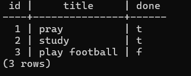

# Task API

A CRUD API for managing tasks, built with FastAPI as part of the FlyRank Backend Internship. The storage layer has evolved through three stages: in-memory (A1), SQLite (A2), and now a containerized PostgreSQL database (A3).

## What this is

A backend API that lets a client create, read, update, and delete tasks. Data is stored in a real PostgreSQL database running inside a Docker container, and the entire stack (API + database) starts with a single command.

## Why Postgres in Docker

- **A real database server** - the same engine behind a large share of production backends, not a single file.
- **No manual install** - Postgres runs as a container from the official image, so nothing is installed directly on the host machine.
- **Consistent everywhere** - docker compose up produces an identical environment on any machine.
- **Data survives restarts** - a named Docker volume keeps the database rows even after the containers are removed and recreated.

## How to run

1. Copy the example environment file and adjust if needed:
   cp .env.example .env
2. Start the whole stack (API + Postgres) with one command:
   docker compose up
3. Visit http://localhost:8000/docs for interactive API docs (Swagger UI).

On first run, the tasks table is created automatically, and 3 example tasks are seeded (only if the table is empty).

To stop everything: docker compose down (data persists). To wipe the data too: docker compose down -v.

## Environment variables

See .env.example for the required variable:

| Variable | Description |
|---|---|
| DATABASE_URL | PostgreSQL connection string used by the API to reach the database |

## Endpoints

| Method | Path | Description |
|--------|------|-------------|
| GET | / | API info |
| GET | /health | Health check |
| GET | /tasks | List all tasks |
| GET | /tasks/{id} | Get a single task |
| POST | /tasks | Create a new task |
| PUT | /tasks/{id} | Update a task |
| DELETE | /tasks/{id} | Delete a task (204 No Content) |

## Example request

curl -i http://localhost:8000/tasks/1

HTTP/1.1 200 OK
content-type: application/json
{"id":1,"title":"pray","done":true}

## Data in the database

Screenshot of the seeded rows, queried directly with psql:

## Storage evolution

This project has used three storage engines with the exact same API on top:

1. A1 - an in-memory Python list (lost on restart)
2. A2 - a local SQLite file (tasks.db)
3. A3 (this stage) - PostgreSQL running in a Docker container, started with docker compose up

The routes never changed - only the module that talks to the database did.
