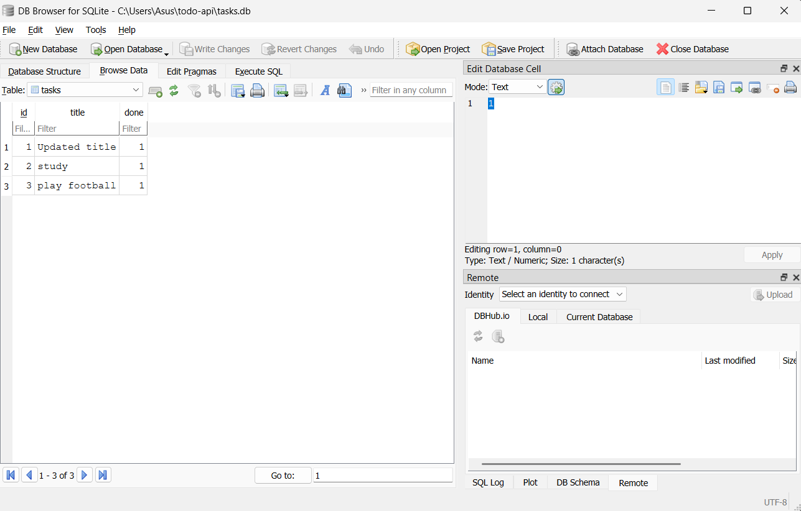
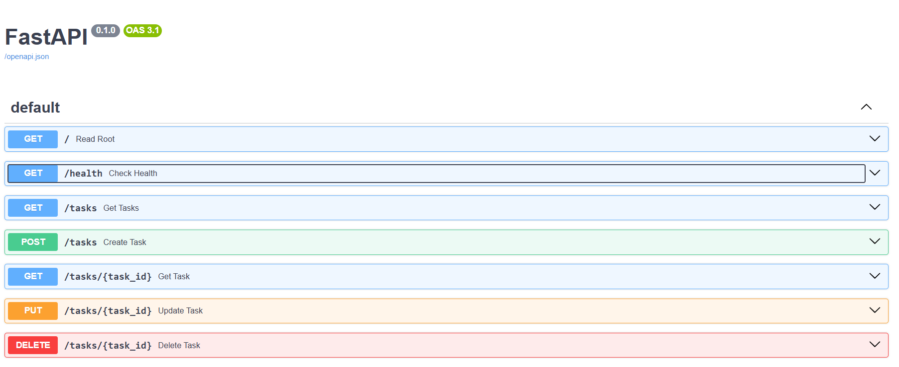

# Task API

A CRUD API for managing tasks, built with FastAPI — originally in-memory (Assignment A1), now backed by a real SQLite database (Assignment A2), as part of the FlyRank Backend Internship.

## What this is

A backend API that lets a client create, read, update, and delete tasks. Data is stored in a SQLite database (`tasks.db`), so it survives a server restart.

## Why SQLite

- **Single file, zero setup** — no separate database server to install or run.
- **Survives restarts** — data lives on disk in `tasks.db`, not in memory.
- Perfect for a small project like this: simple, free, and fast to get running.

## Where the database lives

The database file is `tasks.db`, created automatically the first time the app runs (opening a SQLite file that doesn't exist yet creates it). It is **git-ignored** — each fresh clone starts with an empty database, which gets seeded with 3 example tasks on first run.

## How to run

```
py -3.12 -m pip install fastapi uvicorn
py -3.12 -m uvicorn main:app --reload
```

Then visit `http://127.0.0.1:8000/docs` for interactive API docs (Swagger UI).

On first run, `tasks.db` and the `tasks` table are created automatically, and 3 example tasks are seeded (only if the table is empty).

## Endpoints

| Method | Path              | Description                  |
|--------|-------------------|-------------------------------|
| GET    | `/`                | API info                     |
| GET    | `/health`          | Health check                 |
| GET    | `/tasks`           | List all tasks               |
| GET    | `/tasks/{id}`      | Get a single task             |
| POST   | `/tasks`           | Create a new task             |
| PUT    | `/tasks/{id}`      | Update a task                 |
| DELETE | `/tasks/{id}`      | Delete a task                 |

## Example request

```
curl -i http://127.0.0.1:8000/tasks/1
```

```
HTTP/1.1 200 OK
content-type: application/json

{"id":1,"title":"Updated title","done":true}
```

## Exploring the database by hand

Opened `tasks.db` in [DB Browser for SQLite](https://sqlitebrowser.org) and ran a query directly against it, with the API server still running:

```sql
UPDATE tasks SET done = 1;
```

**Result:** marked all 3 tasks as done. Calling `GET /tasks` right after — with no server restart — instantly reflected the change. This confirmed the API and DB Browser read the exact same file; there is no "syncing", just one source of truth.



## Swagger UI

<<<<<<< HEAD

=======

>>>>>>> e2a021e71de63f62506d12d3ba4ad275b1b1d615
